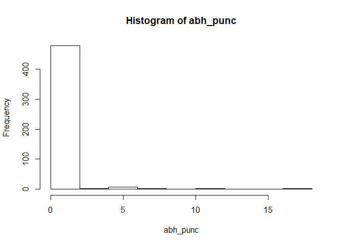
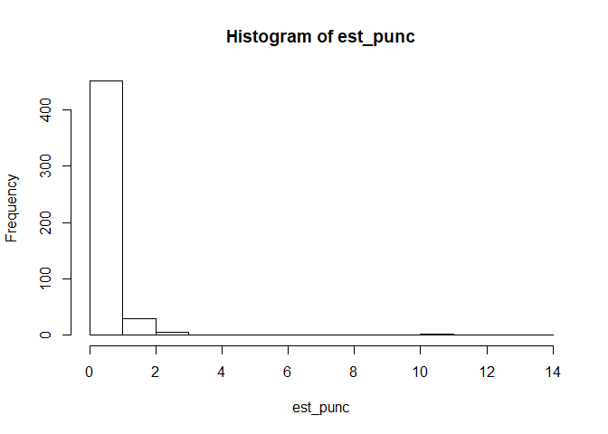

workout03-Zizi-Ren
================
Zizi Ren
2019/12/2

## 0\) Download two html files

``` r
# Read the HTML file
abh <- read_html('abhijit_banerjee.html')
est <- read_html('Esther_Duflo.html')
```

## 1\) Extract simple information of the authors

This section, forms part of the data cleaning process.  
Extract the names of the scholars from the HTML object  
Extract the scholars’ affiliated institutions from the HTML object (NA if
not specified)

``` r
name_abh <- abh %>% html_nodes(xpath = '//*[@id="gsc_prf_in"]') %>%html_text()
name_est <- est %>% html_nodes(xpath = '//*[@id="gsc_prf_in"]') %>%html_text()
name_abh
```

    ## [1] "Abhijit Banerjee"

``` r
name_est
```

    ## [1] "Esther Duflo"

``` r
insti_abh <- NA
insti_est <- est %>% html_nodes(xpath = '//*[@class="gsc_prf_ila"]') %>%html_text()
insti_abh
```

    ## [1] NA

``` r
insti_est
```

    ## [1] "MIT"

## 2\) Extract all the papers for each author (not just the 20 most cited)

This section also forms part of the data cleaning process.

``` r
paperName_abh <- abh %>% html_nodes(xpath = '//*[@class="gsc_a_at"]') %>% html_text()
mix_abh <- abh %>% html_nodes(xpath = '//*[@class="gs_gray"]') %>% html_text()
researcher_abh <- rep("",495)
journal_abh <- rep("",495)
for(i in 1:990){
  if(i %% 2 ==0){
    journal_abh[i/2] <- mix_abh[i]
  }else{
    researcher_abh[(1+i)/2] <- mix_abh[i]
  }
}
cite_abh <- abh %>% html_nodes(xpath = '//*[@class="gsc_a_ac gs_ibl"]') %>% html_text() %>% as.numeric()
year_abh <- abh %>% html_nodes(xpath = '//*[@class="gsc_a_h gsc_a_hc gs_ibl"]') %>% html_text() %>% as.numeric()
citation_abh <- data.frame(paperName_abh,researcher_abh,journal_abh,cite_abh,year_abh)
head(citation_abh)
```

    ##                                                             paperName_abh
    ## 1                                         A simple model of herd behavior
    ## 2                      Occupational choice and the process of development
    ## 3 Poor economics: A radical rethinking of the way to fight global poverty
    ## 4      The miracle of microfinance? Evidence from a randomized evaluation
    ## 5                                          The economic lives of the poor
    ## 6                           Inequality and growth: What can the data say?
    ##                                 researcher_abh
    ## 1                                  AV Banerjee
    ## 2                       AV Banerjee, AF Newman
    ## 3             AV Banerjee, A Banerjee, E Duflo
    ## 4 A Banerjee, E Duflo, R Glennerster, C Kinnan
    ## 5                         AV Banerjee, E Duflo
    ## 6                         AV Banerjee, E Duflo
    ##                                                       journal_abh cite_abh
    ## 1       The quarterly journal of economics 107 (3), 797-817, 1992     7190
    ## 2             Journal of political economy 101 (2), 274-298, 1993     3437
    ## 3                                            Public Affairs, 2011     2911
    ## 4 American Economic Journal: Applied Economics 7 (1), 22-53, 2015     1879
    ## 5          Journal of economic perspectives 21 (1), 141-168, 2007     1800
    ## 6                 Journal of economic growth 8 (3), 267-299, 2003     1399
    ##   year_abh
    ## 1     1992
    ## 2     1993
    ## 3     2011
    ## 4     2015
    ## 5     2007
    ## 6     2003

``` r
write.csv(citation_abh,"citation_abh.csv")
```

``` r
paperName_est <- est %>% html_nodes(xpath = '//*[@class="gsc_a_at"]') %>% html_text()
mix_est <- est %>% html_nodes(xpath = '//*[@class="gs_gray"]') %>% html_text()
researcher_est <- rep("",491)
journal_est <- rep("",491)
for(i in 1:982){
  if(i %% 2 ==0){
    journal_est[i/2] <- mix_est[i+3]
  }else{
    researcher_est[(1+i)/2] <- mix_est[i+3]
  }
}
cite_est <- est %>% html_nodes(xpath = '//*[@class="gsc_a_ac gs_ibl"]') %>% html_text() %>% as.numeric()
year_est <- est %>% html_nodes(xpath = '//*[@class="gsc_a_h gsc_a_hc gs_ibl"]') %>% html_text() %>% as.numeric()
citation_est <- data.frame(paperName_est,researcher_est,journal_est,cite_est,year_est)
head(citation_est)
```

    ##                                                                                                             paperName_est
    ## 1                                                          How much should we trust differences-in-differences estimates?
    ## 2                                                 Poor economics: A radical rethinking of the way to fight global poverty
    ## 3 Schooling and labor market consequences of school construction in Indonesia: Evidence from an unusual policy experiment
    ## 4                                                      The miracle of microfinance? Evidence from a randomized evaluation
    ## 5                Grandmothers and granddaughters: old<U+00A9>\\age pensions and intrahousehold allocation in South Africa
    ## 6                                                                                          The economic lives of the poor
    ##                                 researcher_est
    ## 1          M Bertrand, E Duflo, S Mullainathan
    ## 2             AV Banerjee, A Banerjee, E Duflo
    ## 3                                      E Duflo
    ## 4 A Banerjee, E Duflo, R Glennerster, C Kinnan
    ## 5                                      E Duflo
    ## 6                         AV Banerjee, E Duflo
    ##                                                       journal_est cite_est
    ## 1       The Quarterly journal of economics 119 (1), 249-275, 2004     8865
    ## 2                                            Public Affairs, 2011     2911
    ## 3                  American economic review 91 (4), 795-813, 2001     1935
    ## 4 American Economic Journal: Applied Economics 7 (1), 22-53, 2015     1879
    ## 5               The World Bank Economic Review 17 (1), 1-25, 2003     1830
    ## 6          Journal of economic perspectives 21 (1), 141-168, 2007     1800
    ##   year_est
    ## 1     2004
    ## 2     2011
    ## 3     2001
    ## 4     2015
    ## 5     2003
    ## 6     2007

``` r
write.csv(citation_est,"citation_est.csv")
```

## 3\) Practice with Regular Expressions

Answer the following parts in the Rmd report file. Recall that you should
comment on the obtained outputs (i.e. don’t just include a code chunk
and its value).

### a)

For the two scholars, how many of their paper titles begin with a word
that starts with a vowel, respectively?

``` r
abh_cite <- read.csv("citation_abh.csv")
est_cite <- read.csv("citation_est.csv")
abh_cite <- mutate(abh_cite,first = substr(paperName_abh,1,1))
est_cite <- mutate(est_cite,first = substr(paperName_est,1,1))
vowel_abh <- length(abh_cite[abh_cite$first == 'A' |abh_cite$first == 'E'|abh_cite$first == 'I'|abh_cite$first == 'O'|abh_cite$first == 'U',]$X)
vowel_est <- length(est_cite[est_cite$first == 'A' |est_cite$first == 'E'|est_cite$first == 'I'|est_cite$first == 'O'|est_cite$first == 'U',]$X)
vowel_abh
```

    ## [1] 118

``` r
vowel_est
```

    ## [1] 116

### b)

For the two scholars, how many of their paper titles end with “s”
respectively?

``` r
last_abh <- c()
for(i in abh_cite$X){
  last_abh[i] <- substr(abh_cite$paperName_abh[i],length(abh_cite$paperName_abh[i]),length(abh_cite$paperName_abh[i]))
}
abh_cite <- mutate(abh_cite,last = last_abh)
last_est <- c()
for(i in est_cite$X){
  last_est[i] <- substr(est_cite$paperName_est[i],length(est_cite$paperName_est[i]),length(est_cite$paperName_est[i]))
}
est_cite <- mutate(est_cite,last = last_est)
```

### c)

For the two scholars, find the longest title, respectively (“longest” in
terms of number of characters).

``` r
lengths <- c()
max_length <- function(data){
  for (i in 1:length(data)){
    lengths[i] <- nchar(data[i])
  }
  return(max(lengths))
}
abh_max <- max_length(as.character(abh_cite$paperName_abh))
est_max <- max_length(as.character(est_cite$paperName_est))
abh_max
```

    ## [1] 398

``` r
est_max
```

    ## [1] 398

### d)

For the two scholars, calculate the variable “number of punctuation
symbols in the their titles”. Display summary() statistics of these
variables, and the corresponding histograms.

``` r
library("stringr")
```

    ## Warning: package 'stringr' was built under R version 3.5.3

``` r
num_punc <- c()
puncs <- function(data){
  for (i in 1:length(data)){
    num_punc[i] <- str_count(data[i],',')
  }
  return(num_punc)
}
abh_punc <- puncs(as.character(abh_cite$paperName_abh))
est_punc <- puncs(as.character(est_cite$paperName_est))
summary(abh_punc)
```

    ##    Min. 1st Qu.  Median    Mean 3rd Qu.    Max. 
    ##   0.000   0.000   0.000   0.499   0.000  17.000

``` r
summary(est_punc)
```

    ##    Min. 1st Qu.  Median    Mean 3rd Qu.    Max. 
    ##  0.0000  0.0000  0.0000  0.3238  0.0000 14.0000

``` r
hist(abh_punc)
```

<!-- -->

``` r
hist(est_punc)
```

<!-- -->
